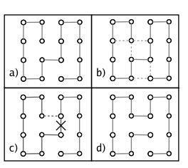

# ⚀ Zip Game ⚀

### What is Zip

Zip is a game, where you need to traverse every cell in the grid(hamiltonian walk) in a specific order. The game is built using angular and 2d canvas drawing and distributed as an electron app.

### Setup

#### Use a pre-built binary

You can find a prebuilt binary for darwin-arm64 machines in the ./out directory

#### Build sources

In the root directory run `npm install`, `npm run build-zip-game` and `npm run build-electron`. Then you can run `npm start` to run it inside an electron application. Or alternately run `npm run serve-zip-game` to run the Angular app in dev mode.

#### Packaging the application

- `npm run package` - first builds both the Electron and Angular components (electron and angular-zip-game) and then uses Electron Forge to package the app for distribution.
- `npm run make` - Similar to the above, but Electron Forge will produce platform-specific distributables or installers.
- `npm run publish-app` - Builds both Electron and Angular components and then employs Electron Forge to publish the built app.

For more information how the packaging is done you can check https://www.electronforge.io/. 

### How to play

The goal of the game is to visit each cell in the grid while making sure the last visited cell is the cell labeled with the highest number. This is actually a hamiltonian path problem with additional constraints and the game uses the algorithm presented in the following paper 

`Oberdorf, R., Ferguson, A., Jacobsen, J. L., & Kondev, J. (2006). Secondary structures in long compact polymers. Physical Review E, 74(5). doi:10.1103/physreve.74.051801` [https://arxiv.org/abs/cond-mat/0508094]

to generate a hamiltonian path. The path is generated by starting with a simple zig zag path 

 

and then repeating the following procedure a random number of times until we are satifies with the paths' randomness.

1. Randomly choose one of the two endpoints of the path.
2. Choose an adjacent cell that is not directly connected to the endpoint.
3. Add an edge between the two cells.
4. Now we have created a cycle, which we can fix by deleting the edge that is on the path from the endpoint to the chosen cell.

The following figure illustrates the procedure. The papers' authors don't give any guarantees about the probability distribution of the resulting paths or even if all paths are generatable. 

There is also an additional option in the menu to add additional walls or play on a larger grid. 

